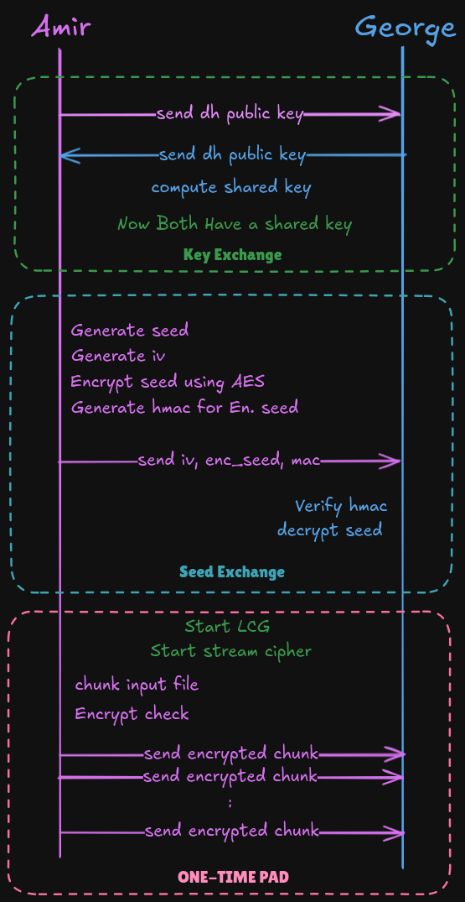

<div align= >

#  OTP Stream Cipher
</div>
<div align="center">
   
</div>


<p align="center"> 
    <br> 
</p>

##  Table of Contents

- <a href ="#about"> 📙 Overview</a>
- <a href ="#features"> ✨ Features</a>
- <a href ="#usage"> 🛠️ Usage</a>
- <a href ="#contributors"> ✨ Contributors</a>
- <a href ="#license"> 🔒 License</a>
<hr style="background-color: #4b4c60"></hr>

<a id = "about"></a>

##  Overview

<br>
<ul> 
<li>One-Time Pad (OTP) Stream Cipher system.</li>
<li>It includes encryption, decryption, and secure key exchange using Diffie-Hellman.</li>
</ul>
<hr style="background-color: #4b4c60"></hr>

<a id="features"></a>

##  Features

<ul>
<li>Secure key exchange using Diffie-Hellman algorithm.</li>
<li>Stream cipher encryption and decryption using Linear Congruential Generator (LCG).</li>
<li>Seed encryption using AES for secure transmission.</li>
<li>HMAC-based authentication for data integrity.</li>
<li>Socket-based communication for data transfer.</li>
</ul>

<hr style="background-color: #4b4c60"></hr>

<a id="usage"></a>

##  Usage


### Running the System

1. **Sender Mode**:

   ```bash
   python main.py sender  --input data/input.txt
   ```

2. **Receiver Mode**:
   ```bash
   python main.py receiver --output data/output.txt
   ```

### Configuration

- Modify `config/config.yaml` to set network and cryptographic parameters.

<hr style="background-color: #4b4c60"></hr>

<a id ="contributors"></a>

##  Contributors

<table  >
  <tr>
      <td align="center"><a href="https://github.com/amir-kedis"><br /><sub><b>Amir Kedis</b></sub></a><br /></td>
     <td align="center"><a href="https://github.com/g-magdy"><br /><sub><b>George Magdy</b></sub></a><br /></td>
  </tr>
</table>

## 🔒 License <a id ="license"></a>

> This software is licensed under MIT License, See [License](LICENSE) for more information ©Amir.
